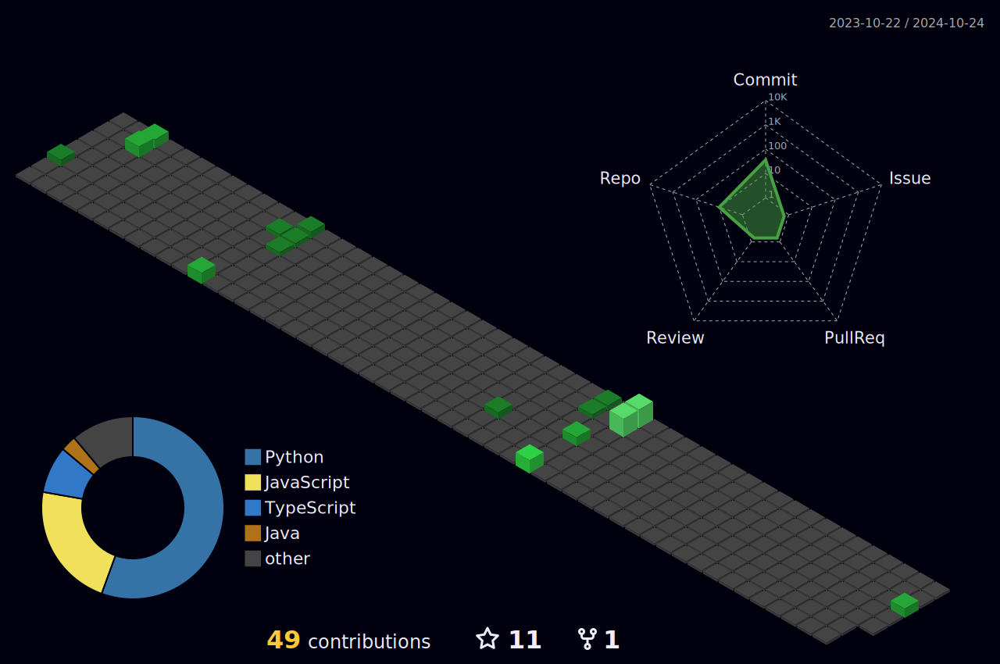

<h1 align="left">Hello!</h1>

  

- 🔭   My name's Victor, i think myself as a tech lover guy!

- 🌱  Actualy i'm studdying **Angular** and **Java**

- 💬  Ask me about **Virtual Reality 🥽**

- 🚀  How to find me: [Linkedin](https://www.linkedin.com/in/victorpicon/)

 

## 🛠 &nbsp;Tech Stack

&nbsp;
&nbsp;
&nbsp;
&nbsp;
&nbsp;
&nbsp;
&nbsp;
&nbsp;
&nbsp;
&nbsp;
&nbsp;
&nbsp;
&nbsp;

##

  

